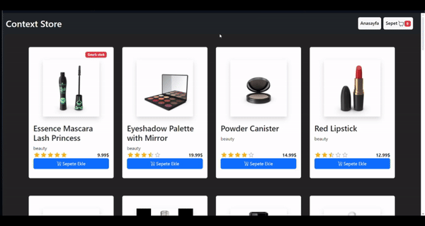

# Basit Alışveriş Sitesi

Bu proje, React kullanılarak oluşturulmuş, ürün bilgilerini API üzerinden çeken, çok sayfalı gezinmeye sahip ve modern stil kütüphaneleriyle tasarlanmış basit bir alışveriş sitesidir. Durum yönetimi için Context API kullanılmıştır.

## Özellikler

- **Ürün Listeleme:** API'den çekilen ürünlerin listelenmesi.
- **Sepete Ekleme:** Ürünleri sepete ekleyebilme.
- **Sepet Yönetimi:** 
  - Sepet sayfası üzerinden ürünlerin miktarını arttırma, azaltma veya ürünü sepetten tamamen silme.
- **Çoklu Sayfa Gezinme:** React Router DOM ile sayfalar arası geçiş.
- **Bildirimler:** Toastify ile kullanıcıya bildirim gösterme.

## Proje Kurulumu

Projeyi yerel ortamınızda çalıştırmak için aşağıdaki adımları izleyin:

1. Projeyi klonlayın:

   ```bash
   git clone https://github.com/react-context-api-example-project.git
   ```

2. Proje dizinine gidin:

   ```bash
   cd react-context-api-example-project
   ```

3. Gerekli bağımlılıkları yükleyin:

   ```bash
   npm install
   ```

4. Projeyi başlatın:

   ```bash
   npm run dev
   ```

## Kullanılan Teknolojiler

- **React** - UI oluşturmak için
- **Context API** - Durum yönetimi için
- **React Router DOM** - Çoklu sayfa navigasyonu için
- **Axios** - API istekleri için
- **Bootstrap** - Stil düzenlemeleri için
- **React Icons** - İkonlar için
- **React Toastify** - Bildirimler için

## Ekran Görüntüleri

### Ana Sayfa



Sepet sayfasında ürünlerin miktarını arttırıp azaltabilir veya ürünleri tamamen sepetten silebilirsiniz.

## Katkıda Bulunma

Katkıda bulunmak isterseniz, pull request açabilir veya issue oluşturabilirsiniz.

